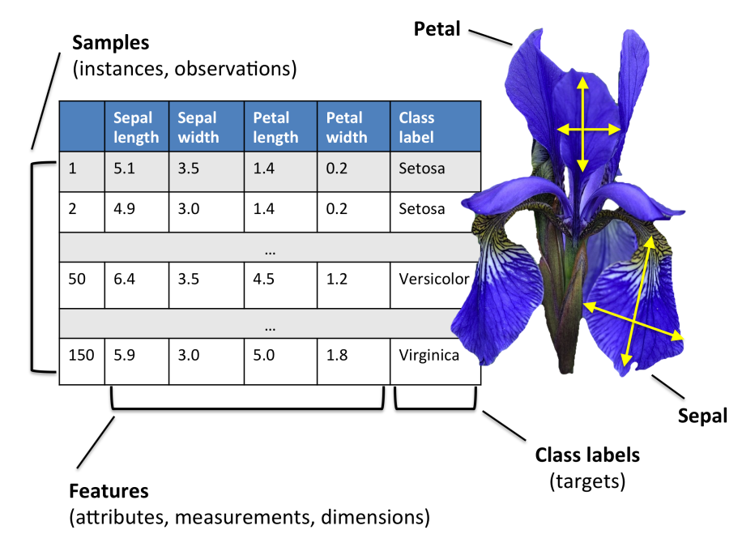
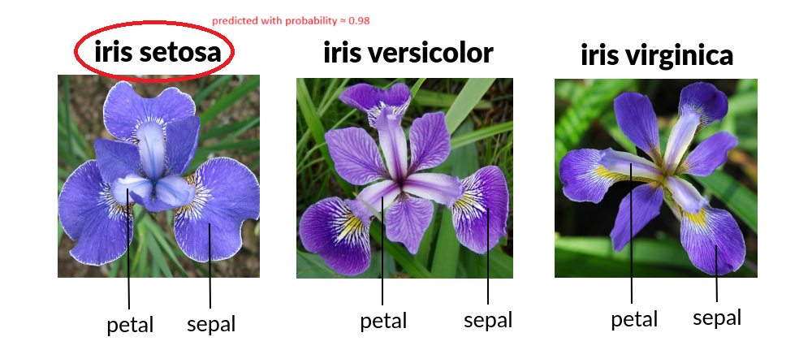

# Iris Machine Learning Model Microservice


[](https://conventionalcommits.org)

A FastAPI microservice for predicting iris species based on sepal and petal dimensions. This project leverages machine learning to classify iris flowers into their respective species.



## Table of Contents

- [Installation](#installation)
- [Usage](#usage)
- [API Endpoints](#api-endpoints)
- [Example Request](#example-request)
- [Sample Response](#sample-response)
- [Dependencies](#dependencies)
- [License](#license)
- [Attribution](#attribution)

## Installation

To set up the project locally, you can choose between two methods: using Docker or a Python virtual environment.

### Method 1: Using Docker

1. Clone the repository:

   ```bash
   git clone https://github.com/LykourgosS/iris-ml-model-microservice.git
   cd iris-ml-model-microservice
   ```

2. Build the Docker image:

   ```bash
   docker build -t iris-ml-model-microservice .
   ```

3. Run the Docker container:
   ```bash
   docker run -d -p 8000:8000 iris-ml-model-microservice
   ```

This will start the server at `http://localhost:8000`. You can then access the API documentation at `http://localhost:8000/docs`.

### Method 2: Using Virtual Environment

1. Clone the repository:

   ```bash
   git clone https://github.com/LykourgosS/iris-ml-model-microservice.git
   cd iris-ml-model-microservice
   ```

2. Create a virtual environment (optional but recommended):

   ```bash
   python -m venv venv
   source venv/bin/activate  # On Windows use `venv\Scripts\activate`
   ```

3. Install the required dependencies:

   ```bash
   pip install -r requirements.txt
   ```

4. Train the model and save it as LRClassifier.pkl:

   ```bash
   python .\app\generate-model.py
   ```

5. Start the FastAPI server:
   ```bash
   uvicorn app.main:app --reload
   ```

This will also start the server at `http://localhost:8000`, and you can access the API documentation at `http://localhost:8000/docs`.

## Usage

Once the server is running (via Docker or virtual environment), you can interact with the API at `http://localhost:8000`, as mentioned above.

## API Endpoints

### Predict Iris Species

- **Endpoint:** `/predict`
- **Method:** `POST`
- **Request Body:**

  ```json
  {
      "sepal_length": <float>,
      "sepal_width": <float>,
      "petal_length": <float>,
      "petal_width": <float>
  }
  ```

- **Response:**
  ```json
  {
      "prediction": "<species>",
      "probability": <float>
  }
  ```

## Example Request

Here's an example of how to make a request to the `/predict` endpoint:

- **Using** `curl`:

```bash
curl -X POST "http://localhost:8000/predict" -H "Content-Type: application/json" -d '{
    "sepal_length": 5.1,
    "sepal_width": 3.5,
    "petal_length": 1.4,
    "petal_width": 0.2
}'
```

- **Using** `python`:

```python
import requests
new_measurement = {
    "sepal_length": 5.1,
    "sepal_width": 3.5,
    "petal_length": 1.4,
    "petal_width": 0.2
}
response = requests.post('http://127.0.0.1:8000/predict', json=new_measurement)
print(response.content)
```

## Sample Response

```json
{
  "prediction": "Iris-setosa",
  "probability": 0.9793734738197287
}
```



## Dependencies

This project requires the following Python packages:

- pandas
- numpy
- pickle
- scikit-learn
- FastAPI
- Uvicorn

You can find the complete list of dependencies in the `requirements.txt` file.

**NOTE:**
Pickle module is a Python built-in module, meaning there is no need to install it separately.

## License

This project is licensed under the GNU General Public License v3.0 - see the [LICENSE](LICENSE) file for details.

## Attribution

This project is based on the following blog post:

- [How to deploy machine learning models as a microservice using fastapi](https://ashutoshtripathi.com/2021/02/15/how-to-deploy-machine-learning-models-as-a-microservice-using-fastapi/) by [Ashutosh Tripathi](https://ashutoshtripathi.com/author/ashutoshtripathi19/)

Special thanks to the author for their guide on deploying a machine learning model as a microservice.
